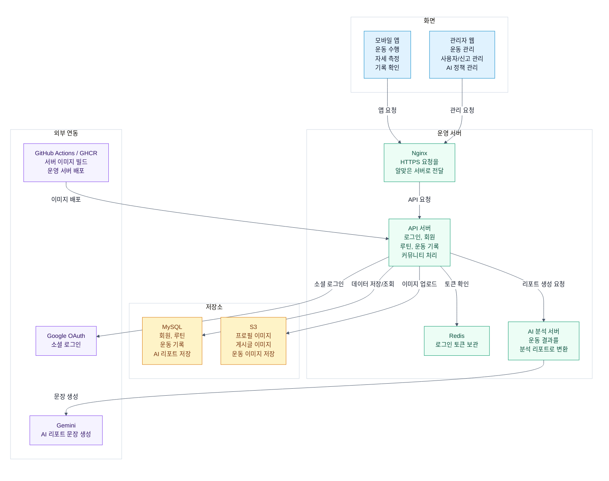
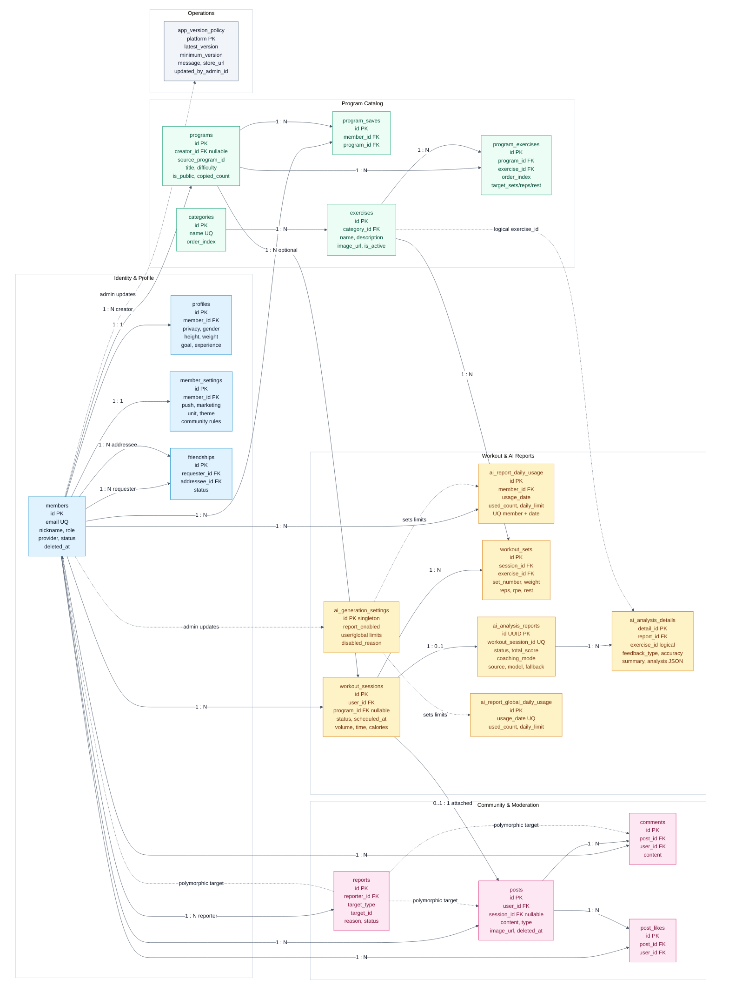

# 마이피티 mAIpt


> 💡 **Notice**  
> 이 레포지토리는 실제 소스 코드를 비공개 처리한 앱의 기술 구조 설명 문서입니다.  
> 앱의 아키텍처, 데이터 모델, AI 분석 파이프라인, 배포/운영 구조를 상세히 담고 있습니다.


### 마이피티 시작하기

마이피티는 Google Play Store에서 설치할 수 있습니다.  
운동 루틴을 만들고, 세트·무게·횟수를 기록하며, AI 자세 분석과 운동 리포트를 통해 운동 과정을 관리해 보세요.

[👉 마이피티 앱 설치하기](https://play.google.com/store/apps/details?id=com.maipt)


<br>

## Service Overview

마이피티는 스마트폰 카메라 기반 자세 측정과 운동 기록을 결합한 홈트레이닝 플랫폼입니다. 사용자는 Flutter 앱에서 루틴을 선택하거나 직접 구성한 뒤 운동을 수행하고, 지원 운동의 경우 온디바이스 자세 코칭을 받을 수 있습니다. 운동 종료 후에는 세트 기록, 자세 측정 결과, 이전 운동 기록을 바탕으로 AI 분석 리포트를 생성합니다.

서비스의 주요 도메인은 `인증/회원`, `운동 카탈로그`, `루틴`, `운동 세션`, `AI 분석 리포트`, `커뮤니티`, `신고/관리자 운영`, `앱 버전 정책`으로 나뉩니다. 각 도메인은 Spring Boot 패키지에서도 분리되어 있으며, 모바일 실시간 처리와 서버 기반 생성형 분석을 분리해 지연 시간과 운영 비용을 관리합니다.

<br>

## Tech Stack

| Area | Stack |
| --- | --- |
| Mobile App | Flutter, Dart, Riverpod, Dio, GoRouter, flutter_secure_storage, Google Sign-In, MediaPipe Pose local package, Flutter TTS |
| Backend API | Java 21, Spring Boot 4.0.1, Spring Security, Spring Data JPA, QueryDSL, WebFlux WebClient, Spring Data Redis, springdoc-openapi |
| AI Server | Python 3.11, FastAPI, Uvicorn, Pydantic, google-genai, Gemini 2.5 Flash, rule-based fallback |
| Admin Web | React 19, TypeScript, Vite 7, React Router, Axios, lucide-react |
| Database & Storage | MySQL 8, AWS RDS, Redis, AWS S3, MinIO for local S3-compatible storage |
| Infra & Delivery | Docker Compose, GHCR, GitHub Actions CI/CD, AWS EC2, AWS Security Group automation, host Nginx reverse proxy |

<br>

## Key Features

<!-- 첫 번째 줄 (2개 배치) -->
<table width="100%">
  <tr>
    <td width="50%" align="center" valign="top">
      <br><br>
      <div align="left">
        <b>🏃‍♂️ 실시간 자세 추적 및 AI 피드백</b>
        <ul>
          <li>모바일 기기 자체(On-device)에서 사용자의 관절 좌표를 실시간으로 추출해 횟수 카운트, 자세 정확도를 제공합니다.</li>
          <li>AI가 운동 결과를 기반으로 한 운동 분석 리포트를 제공합니다.</li>
        </ul>
      </div>
    </td>
    <td width="50%" align="center" valign="top">
      <br><br>
      <div align="left">
        <b>📝 운동 루틴 저장 및 공유</b>
        <ul>
          <li>사용자가 운동 루틴을 생성하고 저장합니다.</li>
          <li>다른 사용자나 운영자가 생성한 루틴을 불러올 수 있습니다.</li>
        </ul>
      </div>
    </td>
  </tr>
</table>

<!-- 두 번째 줄 (3개 배치) -->
<table width="100%">
  <tr>
    <td width="33%" align="center" valign="top">
      <br><br>
      <div align="left">
        <b>📅 캘린더</b>
        <ul>
          <li>나의 운동 기록을 캘린더에서 모아 볼 수 있습니다.</li>
          <li>새로운 운동 계획을 세울 수 있습니다.</li>
          <li>AI 운동 분석 리포트도 확인할 수 있습니다.</li>
        </ul>
      </div>
    </td>
    <td width="33%" align="center" valign="top">
      <br><br>
      <div align="left">
        <b>📊 운동 기록 분석</b>
        <ul>
          <li>주간 칼로리 소모 패턴, 부위별 운동 비율 등의 운동 기록에 대한 분석을 제공합니다.</li>
        </ul>
      </div>
    </td>
    <td width="33%" align="center" valign="top">
      <br><br>
      <div align="left">
        <b>🤝 커뮤니티</b>
        <ul>
          <li>운동 기록과 사진을 게시글로 공유할 수 있습니다.</li>
          <li>댓글과 좋아요를 남길 수 있습니다.</li>
        </ul>
      </div>
    </td>
  </tr>
</table>

<br>

## System Architecture

Mermaid 원본 파일: [docs/diagrams/system-architecture.mmd](./docs/diagrams/system-architecture.mmd)



실시간 자세 측정은 모바일 앱에서 처리하고, 운동이 끝난 뒤 필요한 AI 리포트만 API 서버를 거쳐 AI 분석 서버로 요청합니다. 운영 서버는 Nginx가 요청을 나누고, API 서버가 서비스 기능을 처리하며, 데이터와 이미지는 각각 MySQL과 S3에 저장합니다.

<br>

## Core Features From A Technical Perspective

| Domain | Implementation Focus |
| --- | --- |
| Real-time pose coaching | `pose_mediapipe`가 33개 pose landmark를 추출하고, Flutter 내부 `LocalPoseSessionManager`와 Dart pose engine이 운동별 각도, 반복 횟수, 자세 오류, 평균 정확도를 계산합니다. 프레임 전송은 100ms 단위로 throttling하며, 안정화된 피드백만 TTS로 안내합니다. |
| Workout recording | 운동 세션은 `workout_sessions`와 `workout_sets`로 저장합니다. 루틴 기반 운동과 즉석 추가 운동을 모두 저장할 수 있고, 세트별 중량, 반복 수, RPE, 휴식 시간, 워밍업 여부를 기록합니다. |
| Program catalog | `categories`, `exercises`, `programs`, `program_exercises`로 운동 종목과 루틴 구성을 분리했습니다. 공식 루틴과 사용자 루틴을 같은 `programs` 모델로 관리하고, 복제 루틴은 `source_program_id`와 `copied_count`로 추적합니다. |
| AI report generation | `ai_generation_settings`, `ai_report_daily_usage`, `ai_report_global_daily_usage`로 기능 on/off와 사용량 제한을 관리합니다. 결과는 `ai_analysis_reports`와 `ai_analysis_details`에 저장하며, 생성 출처, 모델명, fallback 사유, prompt version도 함께 남깁니다. |
| Community and moderation | 운동 기록을 게시글에 첨부할 수 있도록 `posts.session_id`를 연결하고, 댓글/좋아요/신고 기능을 분리했습니다. 신고 대상은 게시글, 댓글, 사용자로 확장할 수 있도록 `target_type + target_id` 구조를 사용합니다. |
| Operations | 관리자 웹에서 운동 카탈로그, 루틴, 사용자 상태, 신고 처리, AI 리포트 정책, Android 앱 버전 정책을 관리합니다. 강제 업데이트 정책은 `/public/app-version/android`에서 앱 시작 시 확인할 수 있습니다. |

<br>

## Technical Highlights

- 온디바이스 자세 추적과 서버 기반 생성형 분석을 분리했습니다. 실시간 코칭은 모바일에서 즉시 처리하고, 비용이 큰 AI 리포트 생성은 운동 종료 후 서버에서 제어합니다.
- Spring Boot는 도메인형 패키지 구조를 사용합니다. `domain`은 핵심 비즈니스 기능, `infra`는 FastAPI/S3 같은 외부 연동, `global`은 인증/예외/공통 응답/설정을 담당합니다.
- AI 리포트는 단순 텍스트 저장이 아니라 전체 피드백, 기록 기반 분석, 운동별 자세 분석 상세를 분리 저장합니다. JSON 컬럼에는 findings, next actions, 상세 분석 리스트를 저장합니다.
- Redis는 Refresh Token TTL 저장소로 사용하고, 영속 데이터와 분석 결과는 MySQL에 저장합니다. 인증 세션 성격의 데이터와 서비스 도메인 데이터를 분리했습니다.
- 프로덕션과 로컬 개발 환경의 저장소 차이를 명시적으로 분리했습니다. 운영은 RDS/S3, 로컬은 MySQL/MinIO를 사용하되 동일한 Spring 설정 키와 S3-compatible 인터페이스로 개발 재현성을 확보했습니다.
- GitHub Actions는 변경 경로별로 Flutter, Spring, FastAPI, Homepage 검증을 분리 실행합니다. CD는 GHCR 이미지 빌드 후 EC2에서 `docker compose -f docker-compose-prod.yml up -d`로 배포합니다.

<br>

## Challenges & Solutions

### 1. 실시간 자세 코칭의 지연 시간과 네트워크 비용

초기 구조처럼 프레임 단위 데이터를 서버로 보내면 카메라 프레임 처리마다 네트워크 지연이 생기고, 사용자의 운동 경험이 서버 상태에 의존하게 됩니다. 현재 구현은 pose landmark 추출과 자세 판정을 Flutter 앱 내부로 옮겼습니다. 앱은 세션별로 landmark, 각도, 반복 횟수, 자세 오류 카운트를 계산하고, 운동 종료 후 요약값만 백엔드로 전달합니다. 이 구조 덕분에 실시간 피드백은 오프라인에 가까운 응답성을 유지하고, 서버는 저장과 리포트 생성에 집중합니다.

### 2. 생성형 AI 응답 품질, 실패, 비용 제어

AI 리포트는 외부 LLM 호출에 의존하므로 timeout, 빈 응답, 형식 오류, 비용 증가 문제가 생길 수 있습니다. FastAPI 서버는 요청 데이터를 Pydantic 모델로 검증하고, Gemini 응답을 정해진 JSON 형태로 정규화합니다. Spring Boot는 사용자별 일일 제한과 전체 일일 제한을 먼저 확인하고, WebClient timeout과 FastAPI 오류 코드를 도메인 에러로 매핑합니다. Gemini 호출이 비활성화되거나 실패하는 경우에도 규칙 기반 fallback 리포트를 생성해 사용자가 빈 화면을 보지 않도록 했습니다.

### 3. 운영 환경과 로컬 개발 환경의 저장소 차이

운영은 RDS와 S3를 사용하지만, 로컬 개발에서 같은 외부 리소스를 직접 쓰면 비용과 보안 리스크가 커집니다. `docker-compose.yml`은 MySQL 8과 MinIO를 함께 띄워 개발자가 동일한 API 서버를 로컬에서 실행할 수 있게 하고, `docker-compose-prod.yml`은 RDS/S3와 GHCR 이미지를 사용합니다. S3 연동은 AWS SDK v2와 endpoint 설정을 분리해 운영 S3와 로컬 MinIO를 같은 업로드 코드로 다룰 수 있게 했습니다.

<br>

## Database Design

Mermaid 원본 파일: [docs/diagrams/erd.mmd](./docs/diagrams/erd.mmd)



해당 ERD는 마이피티의 핵심 데이터를 회원, 운동 프로그램, 운동 기록, AI 분석 리포트, 커뮤니티, 운영 정책 영역으로 나누어 표현한 구조입니다.  
회원은 프로필, 설정, 친구 관계와 연결되며, 운동 프로그램은 운동 종목과 루틴 구성을 관리합니다. 사용자가 수행한 운동 세션과 세트 기록은 AI 분석 리포트와 연결되고, 운동 기록은 커뮤니티 게시글에도 첨부될 수 있습니다.  
신고, 앱 버전 정책, AI 리포트 사용량 제한 테이블은 서비스 운영과 관리 기능을 위해 별도로 분리했습니다.

<br>

## Backend Package Structure
실제 개발 레포지토리의 메인 서버(Spring Boot) 핵심 폴더 구조입니다. 계층형/도메인형 아키텍처를 적용하여 관심사를 분리했습니다.

```text
spring-backend/api-server/src/main/java/com/maipt/api
|-- domain
|   |-- analysis      # dashboard, weekly statistics
|   |-- app           # Android version policy
|   |-- auth          # email login, Google login, JWT, logout, withdraw
|   |-- community     # posts, comments, likes
|   |-- member        # member profile, settings, friendships, block
|   |-- program       # categories, exercises, programs, program saves
|   |-- report        # user report and admin resolution
|   `-- workout       # workout sessions, sets, AI report domain
|-- global
|   |-- auth          # Spring Security user detail integration
|   |-- common        # ApiResponse, BaseEntity
|   |-- config        # Security, JPA, Swagger, S3, Web MVC
|   |-- error         # ErrorCode, CustomException, global handler
|   `-- util          # shared utilities
`-- infra
    |-- ai            # FastAPI WebClient integration
    `-- s3            # S3/MinIO image and file upload
```

<br>

## API Overview

| Area | Representative Endpoints |
| --- | --- |
| Auth | `POST /auth/signup`, `POST /auth/login`, `POST /auth/login/google`, `POST /auth/reissue`, `POST /auth/logout`, `POST /auth/withdraw` |
| Member | `GET /members/me`, `GET /members/me/details`, `PUT /members/me/details`, `GET /members/me/settings`, `PATCH /members/me/settings`, `GET /friendships`, `POST /friendships` |
| Program | `GET /categories`, `GET /exercises`, `GET /programs/explore`, `GET /programs/me`, `POST /programs`, `POST /programs/{programId}/copy` |
| Workout | `POST /workouts/sessions`, `GET /workouts/sessions`, `GET /workouts/sessions/calendar`, `GET /workouts/sessions/attachable`, `POST /workouts/{sessionId}/ai-report`, `GET /workouts/{sessionId}/ai-report` |
| Community | `GET /posts`, `POST /posts`, `POST /posts/{postId}/likes`, `POST /posts/{postId}/comments`, `POST /reports` |
| File | `POST /images/upload`, `POST /images/upload/multiple`, `DELETE /images`, `POST /admin/files/upload` |
| Admin | `GET /admin/users`, `PATCH /admin/users/{userId}/status`, `GET /admin/programs`, `GET /admin/exercises`, `GET /admin/reports`, `PUT /admin/ai-settings`, `PUT /admin/app-version/android` |
| Public App Policy | `GET /public/app-version/android` |

상세 API 명세서 확인: [docs/API_spec.md](./docs/API_spec.md)

<br>

## Deployment

### Local Development

```bash
cp .env.example .env
docker compose up --build
```

로컬 Compose는 Spring Boot, FastAPI, MySQL 8, Redis, MinIO, bucket 생성 컨테이너를 실행합니다.

### Production

프로덕션 Compose는 GHCR에 올라간 이미지를 가져와 EC2에서 실행합니다.

```bash
docker compose -f docker-compose-prod.yml pull
docker compose -f docker-compose-prod.yml up -d
```

- `spring-backend`: RDS, S3, Redis, FastAPI와 연결되는 메인 API 서버
- `ai-server`: Gemini API를 호출하는 FastAPI 분석 서버
- `homepage`: `/`, `/privacy`, `/terms`를 제공하는 정적 Nginx 컨테이너

GitHub Actions CD는 `main` push 또는 수동 실행 시 변경된 서버 이미지만 GHCR에 빌드/푸시하고, 배포 직전에 GitHub Actions runner IP를 EC2 보안 그룹에 임시 허용한 뒤 배포 후 제거합니다.

인프라 배포 설정 확인: [builds/docker-compose.yml](./builds/docker-compose.yml)

<br>

## Team

| Name | Responsibility | GitHub |
| --- | --- | --- |
| 강신정 | PM, Backend, AI server advancement, DevOps, Admin web, architecture documentation | [seen02](https://github.com/seen02) |
| 김용준 | Frontend, AI server integration | [kyjglobal](https://github.com/kyjglobal) |
| 이종혁 | MediaPipe pose tracking implementation | - |
| 이승현 | AI model and analysis logic | - |

<br>

## 상세 문서 바로가기
* 🔗 [상세 API 명세서 확인하기](./docs/API_spec.md)
* 🐳 [인프라 배포 설정 확인하기](./builds/docker-compose.yml)

---

### Copyright & License
본 저장소 내의 모든 문서, 아키텍처 다이어그램 및 설계도의 저작권은 작성자(`@seen02`)에게 있으며, 무단 복제 및 도용을 금지합니다.

---
