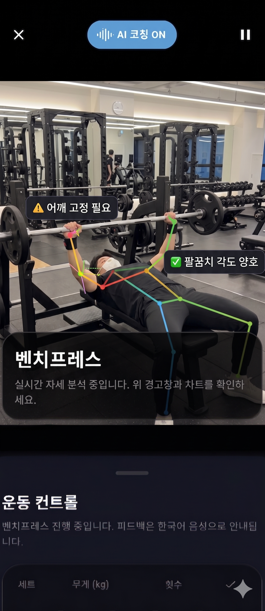
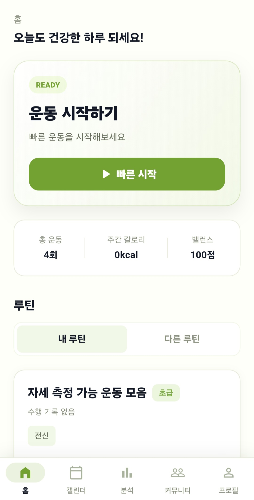
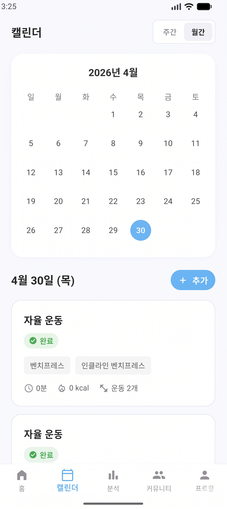
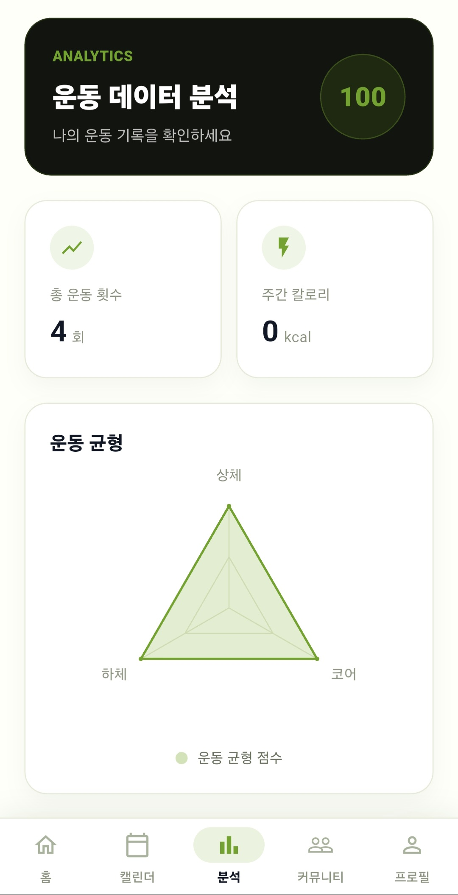
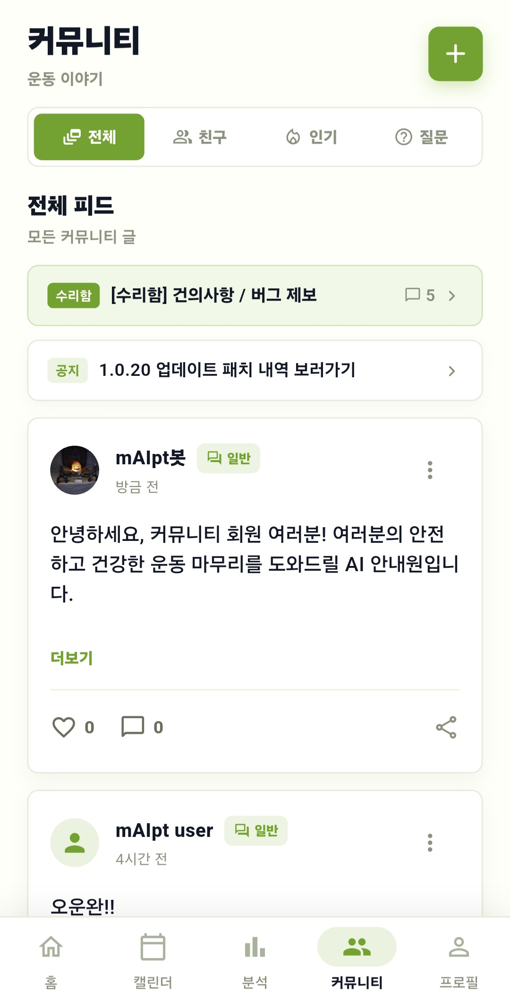
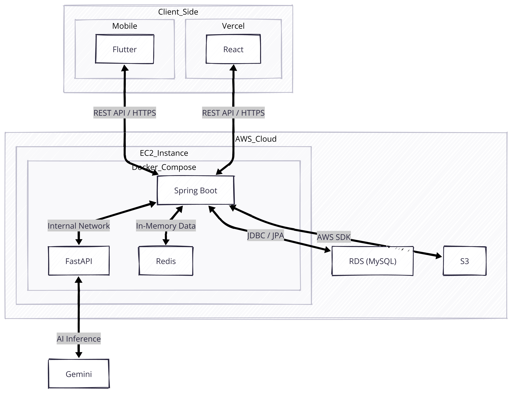
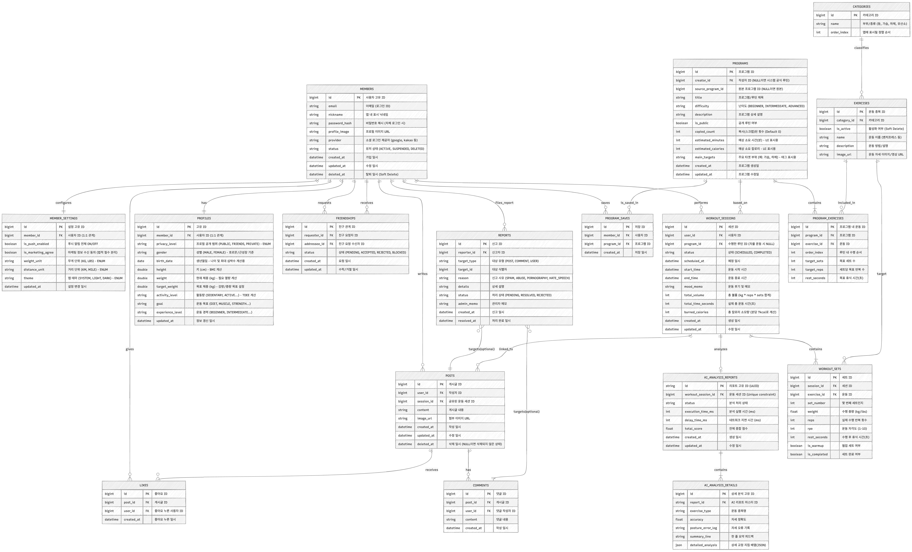

# 마이피티 mAIpt


> 💡 **Notice**  
> 이 레포지토리는 실제 소스 코드를 비공개 처리한 홍보용 공간입니다.  
> 앱 소개, 시스템 아키텍처 및 데이터베이스 구조를 상세히 담고 있습니다.

<br>

대표 이미지 (추가 예정)
## 1. 마이피티 - 내 손 안의 PT 선생님

* "언제 어디서나, 내 스마트폰이 완벽한 PT 선생님이 됩니다."

마이피티(mAIpt)는 비싼 PT 비용과 시간적 제약 때문에 운동을 망설이는 분들을 위해 탄생한 AI 기반 스마트 홈트레이닝 앱입니다.
단순히 운동 영상을 틀어놓고 따라 하는 것을 넘어, 스마트폰 카메라를 통해 사용자의 관절 움직임을 실시간으로 분석하고 올바른 자세를 코칭해 줍니다.
여기에 생성형 AI(Gemini)가 결합되어, 내 운동 기록을 바탕으로 오늘 내게 딱 맞는 운동 플랜과 피드백을 제공합니다.


<br>

## 2. 핵심 기능

<!-- 첫 번째 줄 (2개 배치) -->
<table width="100%">
  <tr>
    <td width="50%" align="center" valign="top">
      <br><br>
      <div align="left">
        <b>🏃‍♂️ 실시간 자세 추적 및 AI 피드백</b>
        <ul>
          <li>모바일 기기 자체(On-device)에서 사용자의 관절 좌표를 실시간으로 추출해 횟수 카운트, 자세 정확도를 제공해요.</li>
          <li>AI가 운동 결과를 기반으로 한 운동 분석 리포트를 제공해요.</li>
        </ul>
      </div>
    </td>
    <td width="50%" align="center" valign="top">
      <br><br>
      <div align="left">
        <b>📝 운동 루틴 저장 및 공유</b>
        <ul>
          <li>사용자가 운동 루틴을 생성하고 저장할 수 있어요.</li>
          <li>다른 사용자나 운영자가 생성한 루틴을 불러올 수 있어요.</li>
        </ul>
      </div>
    </td>
  </tr>
</table>

<!-- 두 번째 줄 (3개 배치) -->
<table width="100%">
  <tr>
    <td width="33%" align="center" valign="top">
      <br><br>
      <div align="left">
        <b>📅 캘린더</b>
        <ul>
          <li>나의 운동 기록을 캘린더에서 모아 볼 수 있어요.</li>
          <li>새로운 운동 계획을 세울 수 있어요.</li>
          <li>AI 운동 분석 리포트도 확인할 수 있어요.</li>
        </ul>
      </div>
    </td>
    <td width="33%" align="center" valign="top">
      <br><br>
      <div align="left">
        <b>📊 운동 기록 분석</b>
        <ul>
          <li>주간 칼로리 소모 패턴, 부위별 운동 비율 등의 운동 기록에 대한 분석을 제공해요.</li>
        </ul>
      </div>
    </td>
    <td width="33%" align="center" valign="top">
      <br><br>
      <div align="left">
        <b>🤝 커뮤니티</b>
        <ul>
          <li>운동 기록과 사진을 게시글로 공유할 수 있어요.</li>
          <li>댓글과 좋아요를 남길 수 있어요.</li>
        </ul>
      </div>
    </td>
  </tr>
</table>

<br>

## 3. 시스템 아키텍처 (System Architecture)



<br>

## 4. 데이터베이스 구조 (ERD)



<br>

## 5. 백엔드 패키지 구조 (Directory Structure)
실제 개발 저장소(Private)의 메인 서버(Spring Boot) 핵심 폴더 구조입니다. 계층형/도메인형 아키텍처를 적용하여 관심사를 분리했습니다.

```text
📦 src/main/java/com/maipt/app
┣ 📂 domain               # 핵심 비즈니스 도메인 (Entity, Enum 등)
┃ ┣ 📂 auth
┃ ┣ 📂 member
┃ ┣ 📂 program
┃ ┣ 📂 workout
┃ ┣ 📂 analysis
┃ ┗ 📂 community
┃
┣ 📂 application          # 비즈니스 로직 처리 (Service)
┃ ┣ 📂 auth
┃ ┣ 📂 member
┃ ┣ 📂 program
┃ ┣ 📂 workout
┃ ┣ 📂 analysis
┃ ┗ 📂 community
┃
┣ 📂 interfaces           # 외부 요청 처리 (Controller, Request/Response DTO)
┃ ┣ 📂 auth
┃ ┣ 📂 member
┃ ┣ 📂 program
┃ ┣ 📂 workout
┃ ┣ 📂 analysis
┃ ┗ 📂 community
┃
┗ 📂 infra                # DB 접근, 외부 API 연동, 전역 설정 (Repository, Client, Config)
  ┣ 📂 repository         # JPA 및 QueryDSL 접근 (DB)
  ┃ ┣ 📂 auth
  ┃ ┣ 📂 member
  ┃ ┣ 📂 program
  ┃ ┣ 📂 workout
  ┃ ┣ 📂 analysis
  ┃ ┗ 📂 community
  ┣ 📂 global             # 전역 공통 설정 및 예외 처리
  ┃ ┣ 📂 config
  ┃ ┣ 📂 error
  ┃ ┣ 📂 common
  ┃ ┗ 📂 util
  ┣ 📂 security           # JWT, 커스텀 인증 등 (기존 auth/jwt 포함)
  ┗ 📂 external           # 외부 시스템 연동
    ┣ 📂 s3
    ┣ 📂 fcm
    ┗ 📂 ai
```

<br>

## 6. 개발자 목록
| **이름** | 강신정 | 김용준 | 이종혁 | 이승현 |
| --- | --- | --- | --- | --- |
| **역할** | PM, 백엔드, DevOps | 프론트엔드, AI 서버 | Mediapipe 자세 추적 기능 구현 | AI 모델 구축 |
| **Github 링크** | https://github.com/seen02 | https://github.com/kyjglobal |  |  |

<br>

## 7. 상세 문서 바로가기
* 🔗 [상세 API 명세서 확인하기](./docs/API_명세서.md)
* 🐳 [인프라 배포 설정 확인하기](./builds/docker-compose.yml)

---

### 📜 Copyright & License
본 저장소 내의 모든 문서, 아키텍처 다이어그램 및 설계도의 저작권은 작성자(`@seen02`)에게 있으며, 무단 복제 및 도용을 금지합니다.

---
